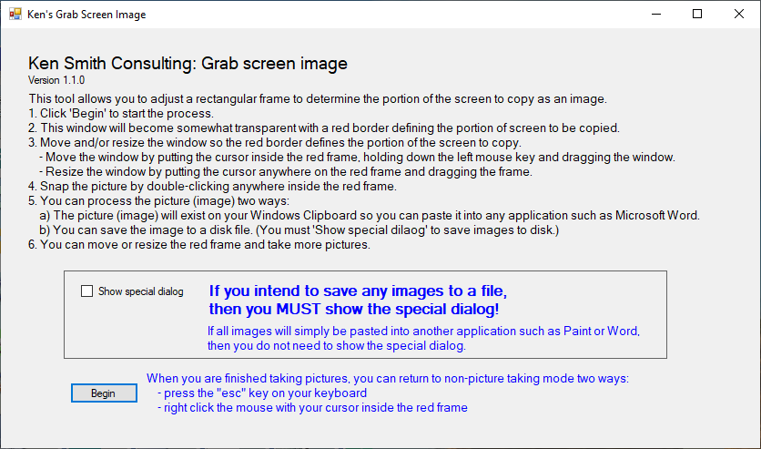
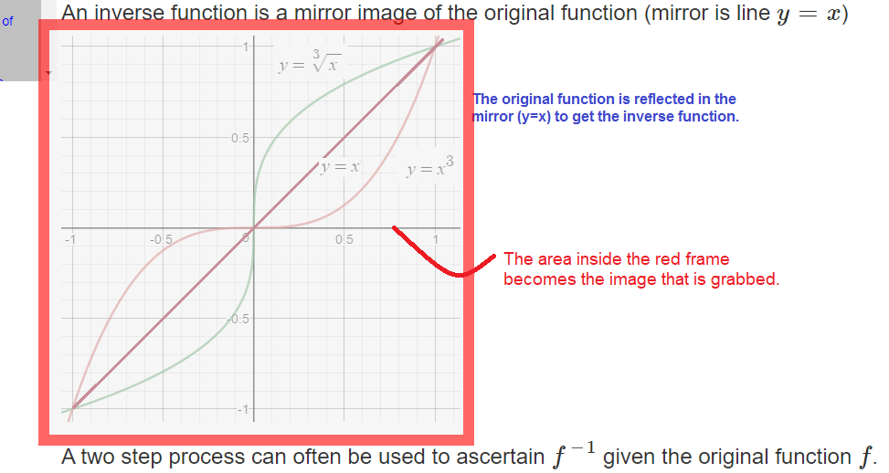

# KenGrabScreenImage  
Select any portion of a Window's screen to copy as an image.  
The image will exist on the Window's clipboard; it can then be pasted into most applications.
There is also an option to save the image to disk.

  

